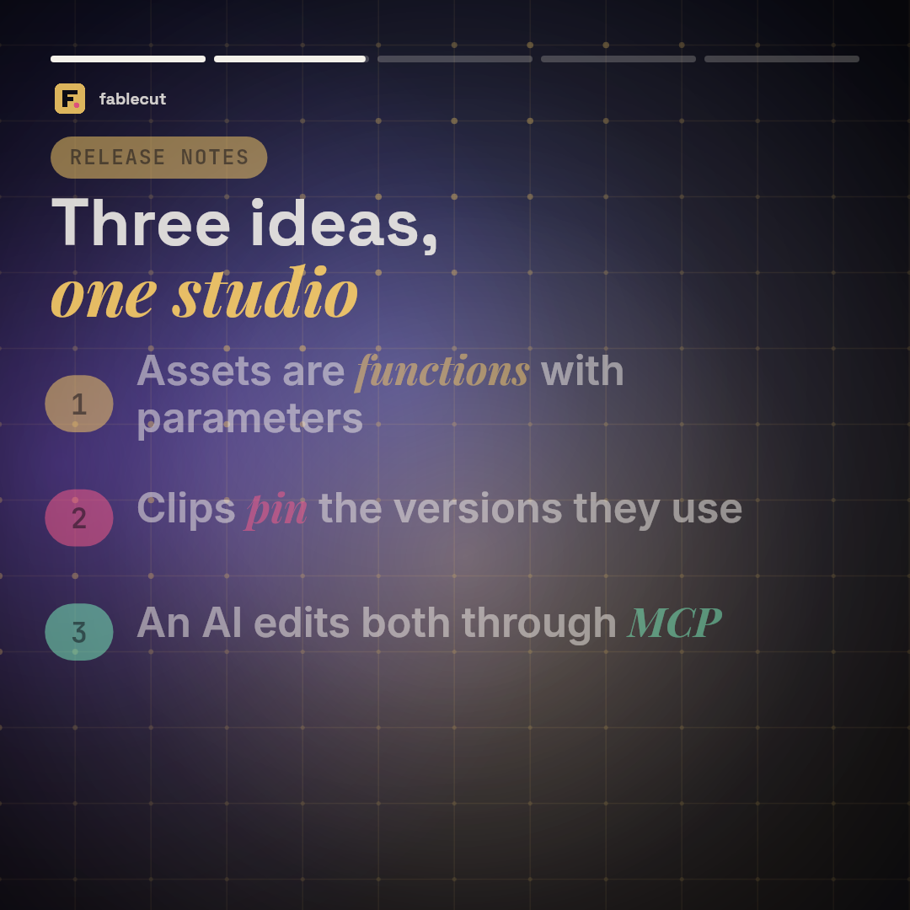
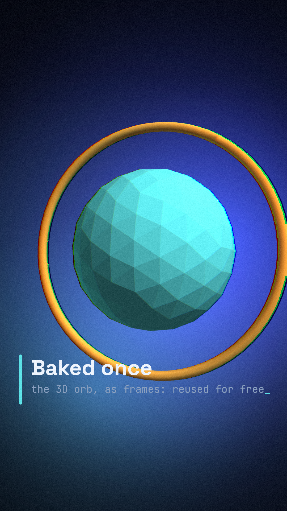
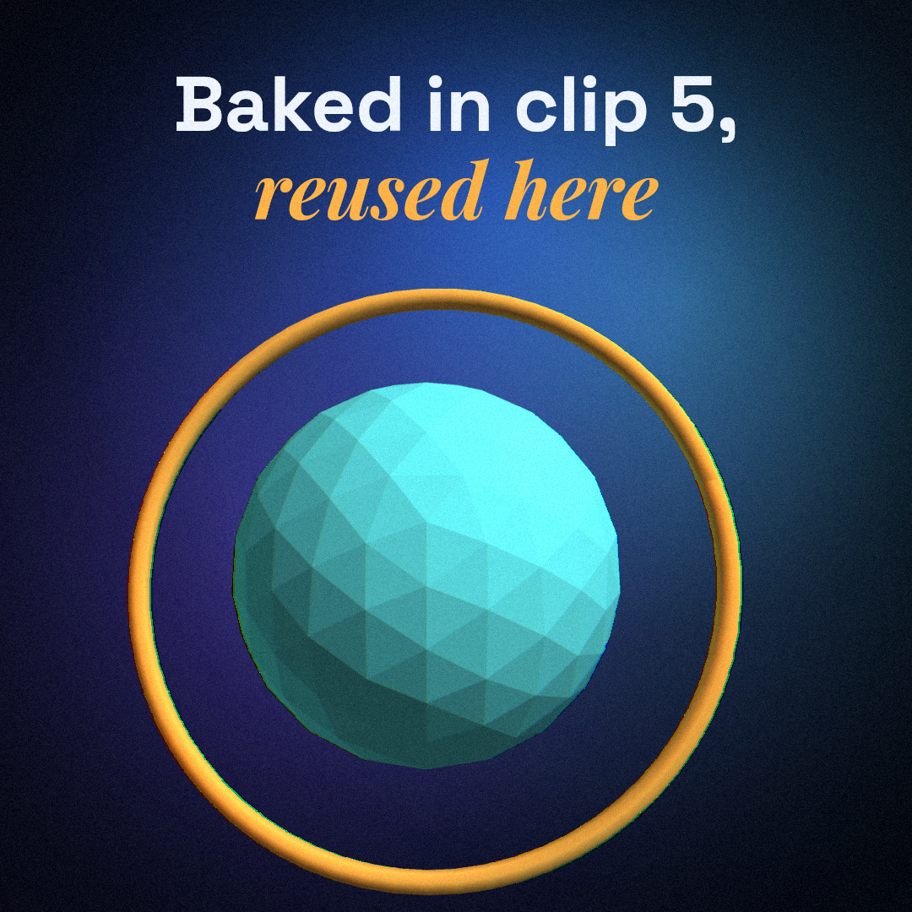
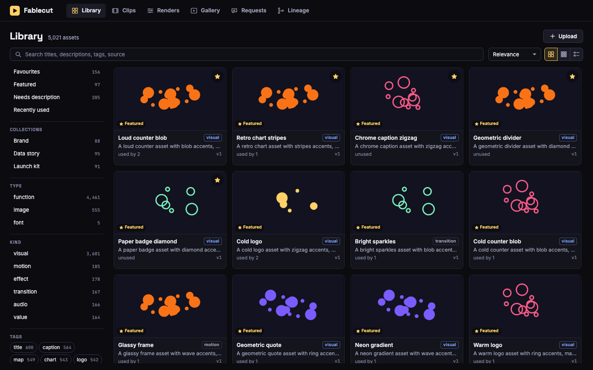
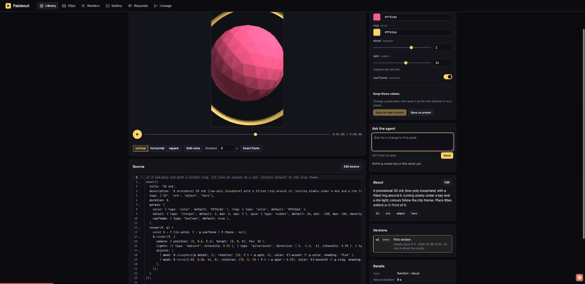
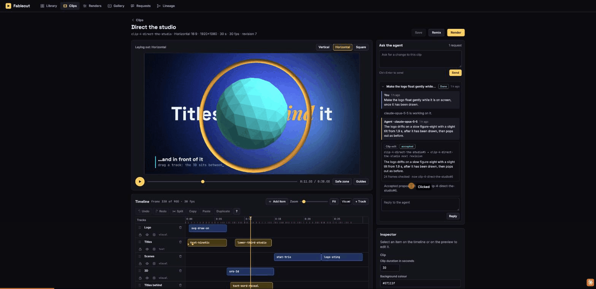
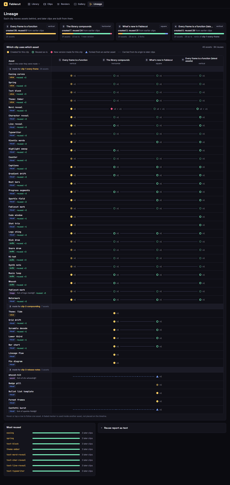

# Fablecut

A studio for making videos with code, where every clip leaves reusable building blocks behind.

Graphics and animation are **assets**: parameterized JavaScript functions that draw a frame from
`(time, params)`. Assets call other assets (a scene calls a lower third, which calls a text reveal,
which calls an easing curve), live in a versioned SQLite library next to images, sounds and fonts,
and are composed into **clips**. The same asset code drives the live preview in the browser and the
final render, which goes frame by frame into FFmpeg and comes out as H.264/AAC MP4. An **MCP
server** lets Claude Code search the library, write and edit assets, compose clips, look at frames
and start renders. From inside the studio you **ask the agent**: a request goes into a queue,
Claude Code answers with a proposal, and you compare it with what is there and accept it.

## The showcase

Six clips, made in order through the MCP server. Each one grew the library and the next one reused it.

Clips 1 to 3, each 32 seconds:

| | clip | format | what it adds | what it reuses |
|---|---|---|---|---|
| [](https://github.com/Narcis13/davidapp/releases/download/showcase-v1/clip-1-every-frame.mp4) | [**Every frame is a function**](https://github.com/Narcis13/davidapp/releases/download/showcase-v1/clip-1-every-frame.mp4) | vertical 1080×1920 | 28 assets: easing, spring, a theme, eight text animations, backgrounds, a code window, counters, a logo, a synthesized soundtrack | nothing: it is the first |
| [](https://github.com/Narcis13/davidapp/releases/download/showcase-v1/clip-2-compounding.mp4) | [**The library compounds**](https://github.com/Narcis13/davidapp/releases/download/showcase-v1/clip-2-compounding.mp4) | horizontal 1920×1080 | 7 assets: a second theme, a grid, a scramble title, a lower third, a bar chart, a lineage diagram, a versioning diagram | 24 from clip 1, one of them (`text-word-reveal`) edited into version 2 |
| [](https://github.com/Narcis13/davidapp/releases/download/showcase-v1/clip-3-release-notes.mp4) | [**What's new in Fablecut**](https://github.com/Narcis13/davidapp/releases/download/showcase-v1/clip-3-release-notes.mp4) | square 1080×1080 | 5 assets: a bullet-list template, a badge, a formats diagram, and two forks of clip 1 assets (a confetti burst, a baked whoosh) | 24 from clip 1 and 5 from clip 2, as they are |

Clips 4 to 6 use what the second iteration added. They were built step by step through the MCP
server and the request flow (uploads, requests and accepted proposals on the user's side), and every
step was journalled, so `npm run showcase` replays them:

| | clip | format | what it adds | what it reuses |
|---|---|---|---|---|
| [](https://github.com/Narcis13/davidapp/releases/download/showcase-v2/clip-4-direct-the-studio.mp4) | [**Direct the studio**](https://github.com/Narcis13/davidapp/releases/download/showcase-v2/clip-4-direct-the-studio.mp4) | horizontal 1920×1080, 30 s; the same composition rendered [vertical](https://github.com/Narcis13/davidapp/releases/download/showcase-v2/clip-4-direct-the-studio-vertical.mp4) and [square](https://github.com/Narcis13/davidapp/releases/download/showcase-v2/clip-4-direct-the-studio-square.mp4) with per-format layouts | 14 assets: four motions, three transitions, four effects, an iris mask, a 3D orb, an SVG draw-on; a preset (`lower-third-studio`) and a precomp (`studio-title-card`) written by the studio; an uploaded photo and an uploaded SVG logo; one change made through a request | kinetic type, the stat scene, the logo sting, a background and the music from clip 1; the word reveal, the lower third and the theme from clip 2 |
| [](https://github.com/Narcis13/davidapp/releases/download/showcase-v2/clip-5-a-library-in-3d.mp4) | [**A library in 3D**](https://github.com/Narcis13/davidapp/releases/download/showcase-v2/clip-5-a-library-in-3d.mp4) | vertical 1080×1920, 60 s | 6 assets: a 3D terrain, 3D block text (and its version 2), a chromatic effect, a glitch transition, two motions; the orb baked into a frame sequence (`orb-spin`); an uploaded JPEG; a lower third added through a request | clip 4's motions, transitions, effects, title-card precomp and preset; text, stats, logo and music from clips 1 and 2 |
| [](https://github.com/Narcis13/davidapp/releases/download/showcase-v2/clip-6-what-the-library-holds.mp4) | [**What the library holds**](https://github.com/Narcis13/davidapp/releases/download/showcase-v2/clip-6-what-the-library-holds.mp4) | square 1080×1080, 90 s | nothing: no new asset code | everything: the title card, 3D terrain and type, the baked orb, a bar chart, stats, text animations, transitions, effects, the uploaded photo, the music |

What each of them cost to build. The calls and the build time (first call to the render request)
come from the journals of the live build (`showcase/journal/*.jsonl`), which recorded every call
with its time; a rebuilt database replays the same calls in seconds, so it cannot give them. Lines
of code and reuse are read from the library. `scripts/reports-v2.mjs` writes the report:

| clip | length | MCP calls | new lines of asset code | timeline items reusing existing assets | build time |
|---|---|---|---|---|---|
| 4 · Direct the studio | 30 s | 40 | 242 | 60 % | 371 s |
| 5 · A library in 3D | 60 s | 20 | 123 | 64 % | 255 s |
| 6 · What the library holds | 90 s | 7 | 0 | 100 % | 76 s |

The MP4s are attached to the [`showcase-v1`](https://github.com/Narcis13/davidapp/releases/tag/showcase-v1)
and [`showcase-v2`](https://github.com/Narcis13/davidapp/releases/tag/showcase-v2) releases (videos
are never committed). Contact sheets, ffprobe reports, the reuse report and the verification
results are in [docs/showcase](docs/showcase/INDEX.md) for clips 1 to 3 and in
[docs/showcase/v2](docs/showcase/v2/INDEX.md) for clips 4 to 6, with the full
[compounding table](docs/showcase/v2/reports/compounding.md).

## Run it

Requirements: Node 24 and FFmpeg (on `PATH`, or set `FFMPEG_PATH`; on Windows the winget install
is found automatically).

```bash
npm install
npm run showcase      # builds the library and the six clips through the MCP server, and renders them
npm run sync-assets   # pushes every asset in assets/ into the library (new or changed ones only)
npm run studio        # the studio: http://127.0.0.1:8787
```

Everything is stored under `./data` (git-ignored): `studio.db`, asset thumbnails, uploaded files,
baked sequences, cached audio and `renders/`. `npm run seed` builds the library and clips without
rendering. Exports and evidence (`npm run evidence`, `npm run verify`) go to `./output` (also
git-ignored). No video is ever committed. The renders of clips 4 to 6 are large (180 to 600 MB
each: film grain does not compress), so leave a few gigabytes free for a full showcase build.

| variable | |
|---|---|
| `STUDIO_DATA` | The data directory (default `./data`). |
| `PORT`, `HOST` | Where the studio listens (default `127.0.0.1:8787`). |
| `STUDIO_AUTHOR` | Recorded as the author of what a process writes (the MCP server defaults to `mcp-client`, `.mcp.json` sets `claude-code`). |
| `STUDIO_TOOLS` | For an MCP server process: a comma-separated list of tool names; only these are registered. A "Run now" session's server gets the tools that read the studio and answer requests. |
| `STUDIO_RUNNER` | For an MCP server process: `0` means it does not pick up queued renders (a short-lived server would take a render down with it). |
| `FFMPEG_PATH` | FFmpeg, when it is not on `PATH`. |
| `STUDIO_RENDER_WORKERS` | Number of render worker threads (default: the CPU count minus two, at most 8). |
| `STUDIO_CLAUDE_BIN` | The `claude` CLI that "Run now" starts (default: `claude` on `PATH`; without one the button is hidden). |
| `STUDIO_AGENT_TIMEOUT` | Seconds a "Run now" session may take (default 600). |
| `CHROME` | The Chrome binary for the parity test and `scripts/parity.mjs`, `scripts/bench-library.mjs` (found automatically in the usual places; the parity test is skipped without one). |

Where things live:

```
assets/          every function asset's source, one flat folder (name.v2.js is version 2 of name)
clips/<name>/    one folder per clip: compose.mjs holds its composition
showcase/        build.mjs + plan.mjs: the MCP calls that rebuild clips 1 to 3;
                 journal/<clip>.jsonl: the recorded steps that rebuild clips 4 to 6; uploads/: their pictures, made by make.mjs
data/            the studio's runtime store: studio.db, thumbnails, files, caches, renders/  (git-ignored)
output/          exported renders, contact sheets and reports                                (git-ignored)
```

```bash
npm test              # asset contract and kinds, composition, 3D, uploads, requests, library at scale, render pipeline, HTTP API, MCP, preview/render parity
npm run verify        # version pinning and determinism, checked by frame hash through MCP
npm run report:reuse  # which clip created what, and what later clips reused
```

Scripts for building and measuring (usage is in each file's header; `STUDIO_DATA` selects the data directory):

```bash
node scripts/act.mjs <clip> <tool> '<json>'             # one MCP call as Claude Code, appended to showcase/journal/<clip>.jsonl
node scripts/act.mjs <clip> --user upload '<json>'      # what the user does in the studio: upload, create_request, accept, reject, reply
node scripts/hashes.mjs out.json [--compare base.json]  # frame hashes of clips 1 to 3; with --compare every hash must be identical
node scripts/speed.mjs out.json [--runs 3] [clip …]     # median render time of clips, through MCP
node scripts/parity.mjs [out-dir]                       # the same frames from the browser preview (headless Chrome) and from Node, with diff images
node scripts/evidence-v2.mjs [out-dir]                  # ffprobe checks, audio levels and contact sheets for the renders of clips 4 to 6
node scripts/reports-v2.mjs [out-dir]                   # the reports of iteration 2 from a showcase data dir and the journals: features, kinds, 3D, z-order, uploads, the clip request, compounding.md
node scripts/workflows-v2.mjs <base-url> [out-dir] [workflow …]      # the studio's workflows driven in headless Chrome with real input (scripts/lib/browser.mjs), each checked and written as a GIF; it changes the data, so run it on a copy
node scripts/speed-compare.mjs <baseline-checkout> <baseline-data> <data> [out-dir] [--runs 5]   # render speed against the code before the iteration, and what effects and 3D cost: render-speed.md
node scripts/synth-library.mjs <data-dir> [--count 5000]             # a seeded synthetic library of thousands of assets
node scripts/bench-library.mjs http://127.0.0.1:8787 [out.json]      # against a studio serving that library: search latency over HTTP, the library screen's DOM size while scrolling
node scripts/dev-seed-v2.mjs                            # development data with every new feature (test fixtures only)
```

## The studio

| | |
|---|---|
| **Library** `/` | Ranked search (text match, boosted by featured, favourites and use) with facets and their counts: type, kind, tags, format, author, the clip that made an asset, the clip that uses it. Sort by relevance, newest, most used or name; favourites, featured, collections, recently used, needs description. A virtualised grid with filmstrip previews, a detail panel, keyboard navigation, multi-select with bulk tagging and add-to-clip. Drop PNG, JPEG, WebP or SVG files on the page to upload them. |
| **Playground** `/assets/<name>` | Live preview of one asset of any kind with controls generated from its parameter schema, a scrub bar, format and safe-zone toggles. Keep a tweak: save the params as the new defaults (a new version) or as a preset, edit title, description and tags without a new version. The source in a CodeMirror editor (validate a draft, save a new version), version diffs (source, and the same frame side by side), versions, lineage. "Exact frame" asks the renderer for the same frame. The agent panel takes a request about this asset and shows the proposal next to the current version. |
| **Clips** `/clips` | Every clip as a card with a poster frame. |
| **Clip editor** `/clips/<name>` | Preview with audio and handles on the canvas: move, scale and rotate a layer, snapping to the frame, the safe zone and other layers. A format switch for per-format layouts. A timeline with move, trim, split, snapping, waveforms and keyframe marks; tracks you reorder, rename, lock, solo, mute and hide; a layers view. An inspector for timing, layout, keyframes with easing, parameters, motions, effects, transition and mask. Multi-select, copy, paste, duplicate, undo and redo (each action is one step; a drag or typing in one field counts as one), keyboard shortcuts (`?` lists them). A split leaves two parts that play on as one. "Save as asset" turns the selected layers into one library asset (a precomp) and can put it in their place. Save, remix into another format, render, and the agent panel for requests about the clip. |
| **Requests** `/requests` | The inbox of requests to the agent by status, and each request's thread with its proposals: preview, accept, reject with a reason, reply, "Run now". |
| **Renders** `/renders` | The queue with live progress, cancel, timings. |
| **Gallery** `/gallery` | Finished clips with their poster, the MP4 and the assets each one used. |
| **Lineage** `/lineage` | Which clip produced which asset and which later clips reused it. |

Every screen updates live when the library, a clip, a render or a request changes, whichever
process made the change.






## Ask the agent

Write what you want in the agent panel of the playground or the clip editor, or on the Requests
screen: "make this slower", "add a lower third at 0:03", "a neon title for the library". The
request is a row in the database, scoped to an asset (with the params on screen), a clip (with the
selected items and the playhead) or the library.

Claude Code works the queue over MCP: `list_requests`, `claim_request` (the thread, the scope and
rendered frames), then `propose_asset_version`, `propose_new_asset` or `propose_clip_edit`. A
proposal is validated and drawn but changes nothing. It appears in the open page without a reload;
you preview it against the current version or clip and accept it (it becomes a new version, a new
asset or a clip revision), reject it, or reply to send the request back. If the asset moved on
since the proposal was made, accepting says so and offers to save it as the next version anyway;
a clip proposal is a list of edit operations, re-applied to the clip as it is when you accept.

```
open ── claim ──▶ working ── propose ──▶ review ── accept ──▶ done
  ▲                                         │
  └──── reply, or reject with a reason ◀────┘        (a claim lasts 15 minutes, then the request is open again)
```

"Run now" starts a headless `claude -p` session on one request from the web server. The session
gets only the studio's MCP server, and that server registers only the tools that read the studio
and answer requests (`STUDIO_TOOLS`) and takes no render jobs (`STUDIO_RUNNER=0`), so what the
session does still lands as a proposal. The prompt goes to the session on stdin, never on the
command line; on Windows an npm `claude.cmd` shim works as well as `claude.exe`. Its progress is
streamed into the thread; it has a timeout and can be cancelled. Without the CLI the queue works the same way from any Claude
Code session started in this folder.

## Write an asset

An asset is one source file that calls `asset({...})` once:

```js
asset({
  title: 'Word reveal',
  description: 'Words rise into place one after another. For headlines.',
  tags: ['text', 'text-animation', 'reveal'],
  duration: 4,                                  // natural length; omit for loops and backgrounds
  uses: ['easing'],                             // other assets it calls; pinned to a version on save
  params: {
    text:  { type: 'text', default: 'Every frame is a *function* of time' },
    size:  { type: 'number', default: 150, min: 12, max: 600 },
    color: { type: 'color', default: '#f4f1ea' },
  },
  render(f, p) {                                // a pure function of (f.t, p)
    const E = f.use('easing');
    const L = f.lib.text.layout(f.ctx, p.text, { font: 'Space Grotesk', weight: 700, size: p.size,
      maxWidth: f.safe.width, maxHeight: f.safe.height, fit: true, align: 'center', markup: true });
    const y = f.safe.y + (f.safe.height - L.height) / 2;
    for (const word of L.words) {
      const k = E.outExpo(f.lib.stagger(f.t, word.index, 0.08, 0.6));
      if (k <= 0) continue;
      f.ctx.globalAlpha = f.lib.clamp01(k * 2);
      f.ctx.fillStyle = p.color;
      f.lib.text.fillWord(f.ctx, word, f.safe.x, y + (1 - k) * 70);
    }
  },
});
```

- `render` may only depend on `f.t`, the params and `f.rng` (seeded). `Math.random()`, the clock,
  timers, modules and the network are rejected; so is anything that draws differently when the
  same frame is drawn twice.
- The parameter schema is what the studio builds controls from and what clips are validated against.
- `f.use('name', params, { x, y, width, height, at, duration })` draws another asset in a box and a
  time window; value assets (easing, themes) return a value instead; audio assets return samples.
- Saving validates the source in a sandbox, renders test frames in every format the asset supports,
  and stores it as an immutable version. Editing makes version 2; whatever pinned version 1 keeps it.

Six kinds, all written and versioned the same way:

| kind | what `render(f, p)` does | where it goes |
|---|---|---|
| `visual` | draws on `f.ctx` | an item on a track; a mask; inside another asset |
| `value` | returns a value (easing curves, a theme) | `f.use` from other assets; the clip's theme |
| `audio` | returns samples | an item on an audio track |
| `motion` | returns a transform delta for `f.phase` in, out, emphasis or loop | `item.motions[]` |
| `transition` | draws `f.from` turning into `f.to` over `f.progress` | `item.transition` |
| `effect` | draws a processed copy of `f.source`, with the pixel helpers in `f.lib.fx` | `item.effects[]`, `track.effects[]`, `composition.effects[]` |

Three more things an asset can do:

- **3D.** `f.lib.solid` is a software rasterizer in plain JavaScript: mesh generators (sphere, box,
  lathe, torus, extrusion, terrain, block text), a camera, lights, flat, smooth and toon shading,
  fog, a depth buffer. No WebGL, so the preview and the render draw the same bytes. Anything heavy
  can be baked once into a frame sequence (`bake_sequence`) and used as a layer.
- **Precomps and presets.** `f.layers(list, params)` draws clip-style layers inside an asset; the
  studio writes such an asset from the layers you pick in a clip ("Save as asset" in the clip
  editor, or `save_precomp`), transitions between them included. A preset is an
  asset plus a set of params as its defaults (`create_preset`).
- **Uploaded pictures.** `f.image(name)` gives an image; `f.svg(name)` gives the vector drawing of
  an uploaded SVG, to draw on stroke by stroke or recolour.

The full contract (the `f` object, the standard library, parameter types, every kind with an
example, transforms and keyframes) is in [docs/ASSET_CONTRACT.md](docs/ASSET_CONTRACT.md), and
recipes for the tools are in [docs/COOKBOOK.md](docs/COOKBOOK.md). Every asset source lives in
[assets/](assets); they are worked examples.

## Use it from Claude Code (MCP)

The repository registers the server in [.mcp.json](.mcp.json), so Claude Code started in this
folder gets a `studio` server with 46 tools:

| | |
|---|---|
| `studio_guide` | The asset contract, the cookbook, the workflows and what is in the library now. Start here. |
| `suggest_assets` | Give the brief of a clip or scene; get the library's best candidates, a few per kind, with params, notes and a contact sheet. The first call of every build. |
| `search_assets`, `get_asset` | Find assets by text, type, kind, tags, format, lineage, favourites, collections, with sorting and facet counts; read source, schema, versions, usage examples from real clips, notes. |
| `validate_asset` | Dry-run a draft: compile, check, and return a filmstrip. Nothing is saved. |
| `create_asset`, `update_asset`, `fork_asset` | Save a new asset, a new version, or a fork. The code is validated and test frames are rendered first; a broken asset is rejected with the reason. |
| `save_defaults`, `create_preset`, `save_precomp` | Keep a tweak: params as a new version's defaults, params as a named preset, clip layers as one asset. |
| `set_asset_metadata`, `organize_assets`, `add_asset_note`, `diff_versions` | Edit title, description and tags without a new version; tag, favourite, feature or collect many assets; leave a note for the next agent; compare two versions (source and frame). |
| `upload_image`, `list_undescribed`, `describe_asset` | Add a PNG, JPEG, WebP or SVG; see the uploads that still need a description and write it (title, description, tags, suggested uses). |
| `add_file_asset`, `bake_asset`, `bake_sequence` | Add an image or sound file; bake one frame (or an audio asset) into a file asset; bake any visual asset into a frame sequence. All keep their lineage. |
| `create_clip`, `update_clip`, `edit_clip`, `get_clip`, `list_clips` | Compose clips; references are pinned and params validated against each asset's schema. `edit_clip` has operations for the timeline, layers, transforms, keyframes and per-format overrides. |
| `remix_clip`, `repin_clip` | A clip in another format; a clip moved to newer asset versions. |
| `render_asset_frame`, `render_clip_frame` | One frame as PNG, or a contact sheet, so the model can see its work. |
| `frame_hashes` | SHA-256 of frames, for checking determinism and that old clips did not change. |
| `start_render`, `get_render`, `list_renders`, `cancel_render` | Render to MP4 (optionally in another format) and follow the queue. |
| `list_requests`, `claim_request`, `get_request`, `reply_request`, `propose_asset_version`, `propose_new_asset`, `propose_clip_edit`, `complete_request` | Work the requests the user wrote in the studio and answer them with proposals. |
| `list_clip_assets`, `reuse_report`, `compounding_report` | What a clip uses and where each asset came from; what each clip cost to build. |

A typical session: *"Call studio_guide, then suggest_assets for a 15-second square clip announcing
our release. Reuse what exists. Show me a contact sheet before you render."* Or, with the studio
open: *"Work the studio's request queue."*

The same tools from a shell, over the same stdio protocol:

```bash
node scripts/mcp.mjs tools
node scripts/mcp.mjs call search_assets '{"tags":["text-animation"]}'
node scripts/mcp.mjs call render_clip_frame '{"clip":"clip-1-every-frame","t":13}' --out frame.png
```

Asset code runs only in worker threads, each asset in its own `vm` context without host globals,
and a watchdog stops a worker that overruns its time. That protects the studio from buggy assets;
it is not a sandbox for hostile code, so only connect clients you trust. The web server answers
only to loopback host names and refuses writes from other origins.

## Make a clip

A clip is a composition: format, frame rate, duration, and tracks of items that place an asset in
time with its parameters.

```js
{
  format: 'vertical', fps: 30, duration: 12, background: '#0b0b12',
  tracks: [
    { id: 'bg', type: 'visual', items: [{ id: 'bg', asset: 'bg-gradient-drift', start: 0, duration: 12 }] },
    { id: 'titles', type: 'text', items: [
      { id: 'hook', asset: 'text-kinetic', start: 0, duration: 4, params: { words: ['HELLO', 'WORLD'] } },
      { id: 'line', asset: 'text-word-reveal', start: 4, duration: 8, params: { text: 'Made with *code*' },
        box: { x: 0.07, y: 0.2, width: 0.86, height: 0.5 }, fadeOut: 0.4 },
    ] },
    { id: 'music', type: 'audio', items: [{ id: 'music', asset: 'music-loop', start: 0, duration: 12, gain: 0.8 }] },
  ],
}
```

Save it with `create_clip` / `update_clip` (or in the clip editor), look at it with
`render_clip_frame`, and render with `start_render` (or the Render button). Saving pins every
reference (`text-word-reveal` becomes `text-word-reveal@2`), so the clip renders the same frames
from then on, whatever happens to its assets. Tracks draw bottom to top; audio items are
synthesized by audio assets and mixed by FFmpeg; the beats found in the first audio item reach
every asset as `f.clip.beats`; an asset with a `cues` parameter is exported to SRT next to the MP4.

### Layout, keyframes and formats

An item can carry a free layout, animation and attachments. This one is from clip 4:

```js
{ id: 'title', asset: 'text-kinetic', start: 0.4, duration: 6.6, params: { words: ['DIRECT', 'THE', 'STUDIO'] },
  transform: { space: 'safe', x: 0.42, y: 0.5, width: 0.8, height: 0.75 },
  keyframes: { rotation: [{ t: 0, v: -5, ease: 'outBack' }, { t: 0.8, v: 0 }] },
  motions: [{ asset: 'motion-slide', phase: 'in', params: { from: 'left', distance: 0.2 } }],
  formats: { vertical: { transform: { x: 0.5, y: 0.42, width: 1, height: 0.5 } }, square: { transform: { x: 0.5, width: 0.95, height: 0.6 } } } }
```

- `transform` places the item's box: `x`, `y`, `width`, `height` are fractions of the frame (or of
  the safe zone with `space: 'safe'`), the anchor sits at (`x`, `y`), and `scale`, `scaleX`,
  `scaleY` and `rotation` (degrees) turn the box about it. The asset draws into the box, so it
  stays sharp at any scale.
- `keyframes` animate the transform fields, `opacity` and numeric or colour params
  (`params.<name>`), with easing curves taken from the library's `easing` asset.
- `formats` overrides the transform, keyframes, params, opacity or visibility for one format, so
  one composition is laid out for vertical, horizontal and square. `start_render { format }` renders
  it in another format; "remix" makes a separate clip.
- `motions`, `effects`, `transition` and `mask` attach assets of those kinds; effects also go on a
  track or on the whole clip. An image or a baked sequence can sit on a visual track directly
  (`params.fit`: `contain`, `cover`, `fill`). `composition.theme` names a theme asset that every
  asset reads as `f.theme`.
- An item without any of these fields is drawn by exactly the code that drew it before they
  existed, so clips 1 to 3 keep their pixels (`scripts/hashes.mjs` compares their frame hashes with a baseline).

The older `box` still works. A remix into another format re-flows what the assets draw (they lay
out from `f.width`, `f.height` and `f.safe`); per-format overrides are for what a hand-tuned
layout still needs.

## Uploads

Drop PNG, JPEG, WebP or SVG files on the library, or call `upload_image`. The type is read from
the bytes, a file already in the library (same SHA-256) is not added twice, and each upload gets
its size, a five-colour palette and a thumbnail. A file is at most 25 MB (a larger body is answered
with 413 and the reason), and an image whose header declares more than 16,384 pixels a side or 64
megapixels is refused before anything decodes it.

An SVG is rebuilt from an allowlist of drawing elements and attributes: scripts, event handlers,
`foreignObject`, embedded images, style sheets, animation and external references are dropped and
reported, and a DOCTYPE or an entity declaration rejects the file. Values are checked the same
way: a `url(...)` other than `url(#id)`, a CSS escape, and any function other than a colour (or a
transform function on a transform attribute) drops the attribute or style property. An SVG whose
`<use>` references multiply the drawing beyond a budget is refused. The sanitised SVG is stored
next to a PNG raster that both the preview and the render draw.

An upload waits on a needs-description list until the agent has looked at it:
`list_undescribed` returns the pictures, `describe_asset` writes the title, description, tags and
suggested uses, and from then on search finds it by those words.

## A library for thousands of assets

Search runs in SQLite: the FTS5 rank, weighted by field, is multiplied by what has proven useful
(featured, favourites, how many clips use it), and each facet is counted under the other filters. On a synthetic library of 5,021 assets the search API answers in 6.5 ms at the median and
80 ms at the 95th percentile, and the library screen keeps 400 to 570 DOM nodes while scrolling to
the last card ([measurements](docs/showcase/v2/reports/library-scale.json)). Make one with
`scripts/synth-library.mjs` and measure it with `scripts/bench-library.mjs`.

## The compounding loop

What makes the next clip cheaper than the last:

- `suggest_assets` ranks the library against a brief, so a build starts from what exists.
- Agents leave notes on assets (`add_asset_note`); `get_asset` shows them with real usage examples
  taken from the clips that use the asset.
- Presets and precomps turn a tuned set of params, or a group of layers, into one reusable piece
  without writing code.
- A clip theme (`composition.theme`, read as `f.theme`) makes new pieces match by default.
- Every MCP call is logged with the clip it served. `compounding_report` (and `/api/compounding`)
  gives, per clip, the calls, the new lines of asset code, the share of timeline items that reuse
  existing assets and the build time, for a clip built live in that database. A database rebuilt
  by `npm run showcase` replays the calls in seconds, so the table under "The showcase" takes its
  calls and build times from the journals of the live build (`scripts/reports-v2.mjs`).

## How it works

```
src/core      the asset runtime, shared by Node and the browser: contract, schema, text layout, composition,
              transforms and keyframes, and the standard library (fx, solid, svg among it)
src/render    Node host: vm sandbox, Skia canvas (@napi-rs/canvas), worker pool, FFmpeg pipeline, WAV, beats
src/studio    library (versioned assets, search), clips (pinned compositions, edit operations), render queue,
              lineage, requests and proposals, "Run now", uploads and the SVG sanitiser, events, compounding: all on SQLite
src/mcp       the MCP tools and the stdio server
src/server    HTTP API, server-sent events, media, static files
src/ui        the studio (vanilla JS, no build step); preview-worker.js runs src/core in a Web Worker
assets        every function asset's source (synced into the library by scripts/sync-assets.mjs)
clips         one folder per clip with its composition
showcase      the plan and the journals that rebuild the six showcase clips
```

- **Rendering.** Worker threads draw frames in parallel with Skia (every frame is a pure function
  of its number, so order does not matter); the main thread writes them in order to FFmpeg's stdin
  as raw RGBA; FFmpeg encodes libx264 `yuv420p` with `+faststart` and mixes the audio inputs into
  AAC. Clips 1 to 3 (32 seconds, 2D, 1080p) render in about 4 to 8 seconds each on the development
  machine (an i9 with 32 logical CPUs, 8 render workers); pixel effects and 3D make clips 4 to 6
  slower than realtime. The numbers, against the code before the second iteration, are in
  [render-speed.md](docs/showcase/v2/reports/render-speed.md)
  ([iteration 1's](docs/showcase/reports/render-speed.md)).
- **One source of truth.** The preview does not re-implement anything: the browser loads the same
  `src/core` modules and the same asset source, and draws on an `OffscreenCanvas` in a worker.
  Effects and 3D are plain arithmetic on pixels rather than canvas filters or WebGL, because those
  differ between Chrome and Skia. `scripts/parity.mjs` draws the same frames both ways and compares them.
- **Library.** `node:sqlite` with FTS5. Asset versions are immutable (triggers enforce it); each
  version stores its source, schema, pinned dependencies, thumbnail, filmstrip, author and lineage.
  Clips store their pinned closure, so usage and reuse are queries. Edits to title, description and
  tags are an overlay on the asset, not a version.
- **Queue.** Renders are rows; the web server and the MCP server share the queue and either can
  run it. Every render keeps the composition it was made from, its FFmpeg log, ffprobe facts and
  SHA-256 hashes of sampled frames.
- **Live updates.** Every change writes a row to an `events` table in the same database, whichever
  process made it. The web server tails the table and pushes server-sent events (`/api/events`);
  the MCP server and the web server never talk to each other.
- **Dependencies.** `@napi-rs/canvas` (Skia), `@modelcontextprotocol/sdk` and `zod` (the MCP
  server), `acorn` (finds the `default:` values to rewrite when params are saved as defaults) and
  `codemirror` with `@codemirror/lang-javascript` (the code editor, served from `node_modules`
  through an import map: no build step, no CDN).

## Licenses

Fonts are bundled under the SIL Open Font License 1.1 (Inter, Space Grotesk, JetBrains Mono, Anton,
Playfair Display); their licenses are in [fonts/licenses](fonts/licenses). All showcase graphics
are drawn by code in this repository and all audio is synthesized by its audio assets; the
pictures uploaded in clips 4 and 5 are made by [showcase/uploads/make.mjs](showcase/uploads/make.mjs)
and the SVG logo is handwritten. There is no third-party media. Emoji fall back to the operating
system's emoji font.
