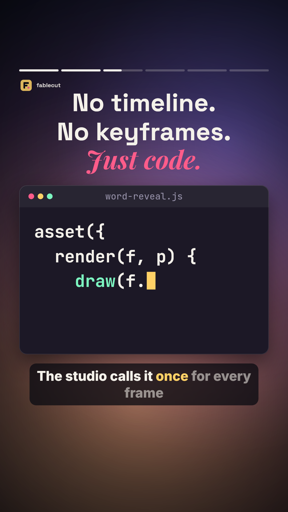
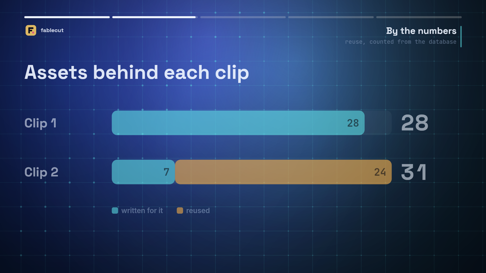
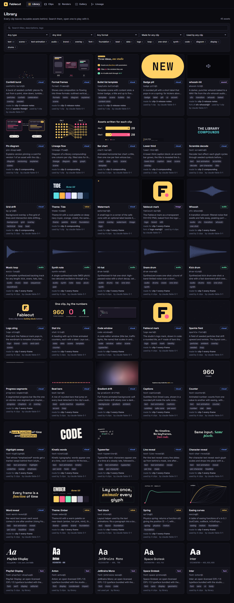
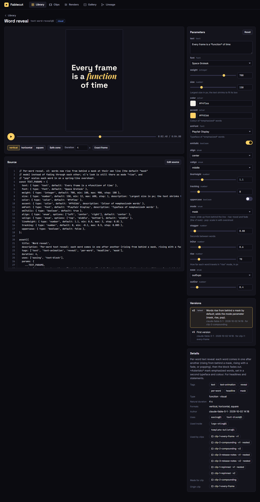
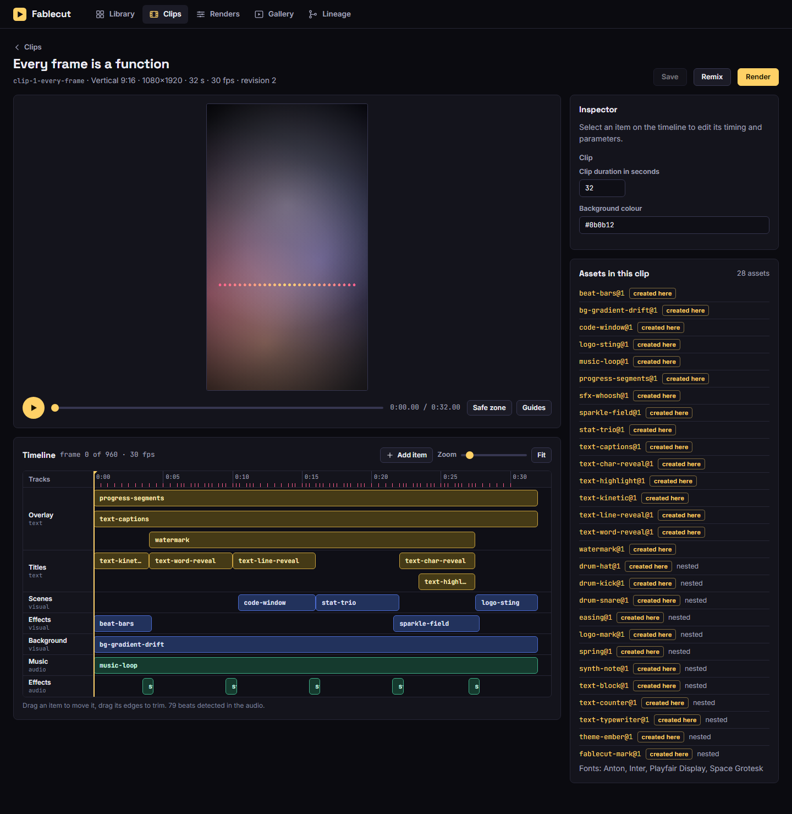

# Fablecut

A studio for making videos with code, where every clip leaves reusable building blocks behind.

Graphics and animation are **assets**: parameterized JavaScript functions that draw a frame from
`(time, params)`. Assets call other assets (a scene calls a lower third, which calls a text reveal,
which calls an easing curve), live in a versioned SQLite library next to images, sounds and fonts,
and are composed into **clips**. The same asset code drives the live preview in the browser and the
final render, which goes frame by frame into FFmpeg and comes out as H.264/AAC MP4. An **MCP
server** lets Claude Code search the library, write and edit assets, compose clips, look at frames
and start renders.

## The showcase

Three clips, each 32 seconds, made in order through the MCP server. Each one grew the library and
the next one reused it.

| | clip | format | what it adds | what it reuses |
|---|---|---|---|---|
| [](docs/showcase/clips/clip-1-every-frame.mp4) | [**Every frame is a function**](docs/showcase/clips/clip-1-every-frame.mp4) | vertical 1080×1920 | 28 assets: easing, spring, a theme, eight text animations, backgrounds, a code window, counters, a logo, a synthesized soundtrack | nothing: it is the first |
| [](docs/showcase/clips/clip-2-compounding.mp4) | [**The library compounds**](docs/showcase/clips/clip-2-compounding.mp4) | horizontal 1920×1080 | 7 assets: a second theme, a grid, a scramble title, a lower third, a bar chart, a lineage diagram, a versioning diagram | 24 from clip 1, one of them (`text-word-reveal`) edited into version 2 |
| [](docs/showcase/clips/clip-3-release-notes.mp4) | [**What's new in Fablecut**](docs/showcase/clips/clip-3-release-notes.mp4) | square 1080×1080 | 5 assets: a bullet-list template, a badge, a formats diagram, and two forks of clip 1 assets (a confetti burst, a baked whoosh) | 24 from clip 1 and 5 from clip 2, as they are |

Contact sheets, ffprobe reports, the reuse report and the verification results are in
[docs/showcase](docs/showcase/INDEX.md).

## Run it

Requirements: Node 24 and FFmpeg (on `PATH`, or set `FFMPEG_PATH`; on Windows the winget install
is found automatically).

```bash
npm install
npm run showcase      # builds the library and the three clips through the MCP server, and renders them
npm run studio        # the studio: http://127.0.0.1:8787
```

Everything is stored under `./data` (git-ignored): `studio.db`, asset thumbnails, cached audio and
`renders/`. Set `STUDIO_DATA` to use another directory, `PORT` for another port. `npm run seed`
builds the library and clips without rendering.

```bash
npm test              # 56 tests: asset contract, text layout, database, render pipeline, HTTP API, MCP
npm run verify        # version pinning and determinism, checked by frame hash through MCP
npm run report:reuse  # which clip created what, and what later clips reused
```

## The studio

| | |
|---|---|
| **Library** `/` | Search the assets by text, type, kind, tag, format, the clip that made them or the clip that uses them. |
| **Playground** `/assets/<name>` | Live preview of one asset with controls generated from its parameter schema, a scrub bar, format and safe-zone toggles, its source (editable: validate a draft, save a new version), its versions and its lineage. "Exact frame" asks the renderer for the same frame. |
| **Clip editor** `/clips/<name>` | Preview with audio, a timeline of tracks and items you can select, move and trim, an inspector with the same generated controls, safe-zone and guide overlays, save, remix into another format, render. |
| **Renders** `/renders` | The queue with live progress, cancel, timings. |
| **Gallery** `/gallery` | Finished clips with their poster, the MP4 and the assets each one used. |
| **Lineage** `/lineage` | Which clip produced which asset and which later clips reused it. |






## Write an asset

An asset is one source file that calls `asset({...})` once:

```js
asset({
  title: 'Word reveal',
  description: 'Words rise into place one after another. For headlines.',
  tags: ['text', 'text-animation', 'reveal'],
  duration: 4,                                  // natural length; omit for loops and backgrounds
  uses: ['easing'],                             // other assets it calls; pinned to a version on save
  params: {
    text:  { type: 'text', default: 'Every frame is a *function* of time' },
    size:  { type: 'number', default: 150, min: 12, max: 600 },
    color: { type: 'color', default: '#f4f1ea' },
  },
  render(f, p) {                                // a pure function of (f.t, p)
    const E = f.use('easing');
    const L = f.lib.text.layout(f.ctx, p.text, { font: 'Space Grotesk', weight: 700, size: p.size,
      maxWidth: f.safe.width, maxHeight: f.safe.height, fit: true, align: 'center', markup: true });
    const y = f.safe.y + (f.safe.height - L.height) / 2;
    for (const word of L.words) {
      const k = E.outExpo(f.lib.stagger(f.t, word.index, 0.08, 0.6));
      if (k <= 0) continue;
      f.ctx.globalAlpha = f.lib.clamp01(k * 2);
      f.ctx.fillStyle = p.color;
      f.lib.text.fillWord(f.ctx, word, f.safe.x, y + (1 - k) * 70);
    }
  },
});
```

- `render` may only depend on `f.t`, the params and `f.rng` (seeded). `Math.random()`, the clock,
  timers, modules and the network are rejected; so is anything that draws differently when the
  same frame is drawn twice.
- The parameter schema is what the studio builds controls from and what clips are validated against.
- `f.use('name', params, { x, y, width, height, at, duration })` draws another asset in a box and a
  time window; value assets (easing, themes) return a value instead; audio assets return samples.
- Saving validates the source in a sandbox, renders test frames in every format the asset supports,
  and stores it as an immutable version. Editing makes version 2; whatever pinned version 1 keeps it.

The full contract (the `f` object, the standard library, parameter types, audio and value assets)
is in [docs/ASSET_CONTRACT.md](docs/ASSET_CONTRACT.md). The 39 showcase asset sources in
[showcase/assets](showcase/assets) are worked examples.

## Use it from Claude Code (MCP)

The repository registers the server in [.mcp.json](.mcp.json), so Claude Code started in this
folder gets a `studio` server with these tools:

| | |
|---|---|
| `studio_guide` | The asset contract and what is in the library now. Start here. |
| `search_assets`, `get_asset` | Find assets by text, type, kind, tags, format, lineage; read source, schema, versions, usage. |
| `validate_asset` | Dry-run a draft: compile, check, and return a filmstrip. Nothing is saved. |
| `create_asset`, `update_asset`, `fork_asset` | Save a new asset, a new version, or a fork. The code is validated and test frames are rendered first; a broken asset is rejected with the reason. |
| `add_file_asset`, `bake_asset` | Add an image or sound file; bake a frame (or an audio asset) into a file asset with lineage. |
| `create_clip`, `update_clip`, `edit_clip`, `get_clip`, `list_clips` | Compose clips; references are pinned and params validated against each asset's schema. |
| `remix_clip`, `repin_clip` | A clip in another format; a clip moved to newer asset versions. |
| `render_asset_frame`, `render_clip_frame` | One frame as PNG, or a contact sheet, so the model can see its work. |
| `frame_hashes` | SHA-256 of frames, for checking determinism and that old clips did not change. |
| `start_render`, `get_render`, `list_renders`, `cancel_render` | Render to MP4 and follow the queue. |
| `list_clip_assets`, `reuse_report` | What a clip uses and where each asset came from. |

A typical session: *"Call studio_guide, search the library for text animations, then make a
15-second square clip announcing our release, reusing what exists. Show me a contact sheet before
you render."*

The same tools from a shell, over the same stdio protocol:

```bash
node scripts/mcp.mjs tools
node scripts/mcp.mjs call search_assets '{"tags":["text-animation"]}'
node scripts/mcp.mjs call render_clip_frame '{"clip":"clip-1-every-frame","t":13}' --out frame.png
```

Asset code runs only in worker threads, each asset in its own `vm` context without host globals,
and a watchdog stops a worker that overruns its time. That protects the studio from buggy assets;
it is not a sandbox for hostile code, so only connect clients you trust.

## Make a clip

A clip is a composition: format, frame rate, duration, and tracks of items that place an asset in
time with its parameters.

```js
{
  format: 'vertical', fps: 30, duration: 12, background: '#0b0b12',
  tracks: [
    { id: 'bg', type: 'visual', items: [{ id: 'bg', asset: 'bg-gradient-drift', start: 0, duration: 12 }] },
    { id: 'titles', type: 'text', items: [
      { id: 'hook', asset: 'text-kinetic', start: 0, duration: 4, params: { words: ['HELLO', 'WORLD'] } },
      { id: 'line', asset: 'text-word-reveal', start: 4, duration: 8, params: { text: 'Made with *code*' },
        box: { x: 0.07, y: 0.2, width: 0.86, height: 0.5 }, fadeOut: 0.4 },
    ] },
    { id: 'music', type: 'audio', items: [{ id: 'music', asset: 'music-loop', start: 0, duration: 12, gain: 0.8 }] },
  ],
}
```

Save it with `create_clip` / `update_clip` (or in the clip editor), look at it with
`render_clip_frame`, and render with `start_render` (or the Render button). Saving pins every
reference (`text-word-reveal` becomes `text-word-reveal@2`), so the clip renders the same frames
from then on, whatever happens to its assets. Tracks draw bottom to top; audio items are
synthesized by audio assets and mixed by FFmpeg; the beats found in the first audio item reach
every asset as `f.clip.beats`; an asset with a `cues` parameter is exported to SRT next to the MP4.

Item boxes are fractions of the frame. A remix into another format re-flows what the assets draw
(they lay out from `f.width`, `f.height` and `f.safe`), but a composition tuned by hand for one
format may still want its boxes adjusted.

## How it works

```
src/core      the asset runtime, shared by Node and the browser: contract, schema, text layout, composition
src/render    Node host: vm sandbox, Skia canvas (@napi-rs/canvas), worker pool, FFmpeg pipeline, WAV, beats
src/studio    library (versioned assets), clips (pinned compositions), render queue, lineage: all on SQLite
src/mcp       the MCP tools and the stdio server
src/server    HTTP API, media, static files
src/ui        the studio; preview-worker.js runs src/core in a Web Worker
showcase      the three clips: asset sources, compositions, and the plan of MCP calls that builds them
```

- **Rendering.** Worker threads draw frames in parallel with Skia (every frame is a pure function
  of its number, so order does not matter); the main thread writes them in order to FFmpeg's stdin
  as raw RGBA; FFmpeg encodes libx264 `yuv420p` with `+faststart` and mixes the audio inputs into
  AAC. A 32-second 1080p clip renders in 5 to 8 seconds on the development machine
  ([measurements](docs/showcase/reports/render-speed.md)).
- **One source of truth.** The preview does not re-implement anything: the browser loads the same
  `src/core` modules and the same asset source, and draws on an `OffscreenCanvas` in a worker.
- **Library.** `node:sqlite` with FTS5. Asset versions are immutable (triggers enforce it); each
  version stores its source, schema, pinned dependencies, thumbnail, author and lineage. Clips store
  their pinned closure, so usage and reuse are queries.
- **Queue.** Renders are rows; the web server and the MCP server share the queue and either can
  run it. Every render keeps the composition it was made from, its FFmpeg log, ffprobe facts and
  SHA-256 hashes of sampled frames.

## Licenses

Fonts are bundled under the SIL Open Font License 1.1 (Inter, Space Grotesk, JetBrains Mono, Anton,
Playfair Display); their licenses are in [fonts/licenses](fonts/licenses). All showcase graphics
are drawn by code in this repository and all audio is synthesized by its audio assets; there is no
third-party media. Emoji fall back to the operating system's emoji font.
